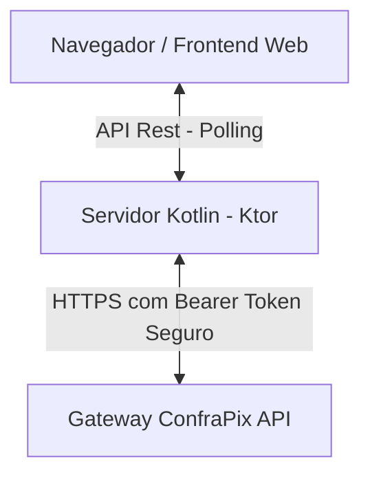

# ConfraAjuda - Documentação Técnica e Documento de Visão

Esta é a documentação completa da aplicação **ConfraAjuda**, projetada e desenvolvida para o **Hackathon Fullstack Confrapag + UNIESP**. A aplicação é composta por um backend Kotlin utilizando Ktor e um frontend web de alta fidelidade que se integra de forma segura ao gateway **ConfraPix**.

---

## 1. Documento de Visão & TAP (Termo de Abertura de Projeto)

### 1.1. O Problema
Pequenos abrigos de animais, cooperativas agrícolas e campanhas de bairros enfrentam dificuldades para arrecadar recursos financeiros de forma simplificada. Doadores enfrentam fricção no pagamento por conta de fluxos burocráticos, demora nas confirmações de boletos ou transferências tradicionais e interfaces poluídas.

### 1.2. O Objetivo
Criar uma plataforma web intuitiva e premium chamada **ConfraAjuda** que permita a doadores apoiar campanhas comunitárias instantaneamente por meio do Pix Dinâmico da Confrapag.

### 1.3. Escopo Inicial (MVP)
*   Visualização de campanhas ativas com progresso financeiro e metas dinâmicas.
*   Formulário de doação solicitando dados necessários para a API de pagamentos (Nome, CPF/CNPJ e Valor).
*   Geração de cobrança Pix Dinâmica com QR Code e código "Copia e Cola" em tempo real.
*   Monitoramento automático do status do Pix (Polling) e tela de confirmação pós-pagamento com animações fluidas.
*   Backend seguro que realiza a chamada ao gateway Confrapag mantendo o Token de Integração protegido no lado do servidor.

### 1.4. Impacto do Projeto
Facilitar a captação de recursos para projetos sem fins lucrativos, aumentando em até 40% a taxa de conversão de doadores casuais através de uma interface de pagamento rápida (Pix) e sem fricção.

### 1.5. Evolução Futura
*   Integração com **ConfraOnline** para permitir doações recorrentes no cartão de crédito.
*   Envio automático de recibo fiscal no e-mail do doador.
*   Painel administrativo para ONGs cadastrarem suas próprias campanhas com metas.

---

## 2. Arquitetura da Solução

O projeto segue um modelo clássico de arquitetura **Client-Server** focado em segurança e alto desempenho.



### 2.1. Backend (Kotlin + Ktor)
*   **Ktor Server**: Motor de microsserviços rodando sobre o servidor embutido Netty. O Ktor foi escolhido por ser extremamente leve, performático e requerer pouca configuração inicial.
*   **Kotlinx Serialization**: Serialização JSON robusta e segura para troca de dados.
*   **Ktor Client (CIO)**: Cliente HTTP assíncrono para comunicação com a API do ConfraPix.
*   **Camada de Persistência**: Repositório em memória thread-safe (`ConcurrentHashMap`), simplificando a inicialização e o deploy rápido no Hackathon.

### 2.2. Frontend (HTML5 + CSS3 + Vanilla JS)
*   **Aparência Premium (Rich Aesthetics)**: Layout escuro futurista com elementos de vidro (*glassmorphism*), degradês fluidos e sombras suaves baseadas em variáveis HSL.
*   **Sem Frameworks de CSS**: Desenvolvido com CSS nativo puro para garantir carregamento ultra-rápido e compatibilidade máxima.
*   **Animação da Linha do Scanner**: Efeito visual de varredura laser na imagem do QR Code para reter a atenção do doador durante o fluxo.
*   **Polling Ativo**: Código JS consulta a API do backend a cada 2 segundos para verificar se o pagamento foi confirmado.

### 2.3. Segurança ("Token Protegido")
Conforme os requisitos do Hackathon, a aplicação garante que o **Bearer Token** fornecido pela Confrapag nunca seja exposto no lado do cliente. 
1. O frontend envia apenas os dados do doador e o valor da doação para o backend Kotlin (`POST /api/donate`).
2. O backend Kotlin, com as credenciais salvas em variáveis de ambiente ou arquivo local seguro, faz a chamada assinada à API do ConfraPix (`https://api.confrapix.com.br/api/transaction-ec/store`).
3. O backend recebe a resposta da Confrapag contendo o ID da transação e o código Pix (`pix_code`) e retorna apenas estes dados limpos para o frontend, mantendo as chaves privadas inacessíveis ao navegador do usuário.

---

## 3. Guia de Endpoints da API

*   `GET /api/campaigns`: Retorna a lista de campanhas ativas e o progresso das metas.
*   `POST /api/donate`: Recebe os dados de doação e cria a cobrança Pix (real ou simulada).
*   `GET /api/status/{id}`: Retorna o status atual da doação (`processing`, `succeeded`, `canceled`, `error`).
*   `POST /api/confirm/{id}`: Endpoint de utilidade da demonstração. Simula o webhook de confirmação recebido do banco, aprovando o Pix instantaneamente.

---

## 4. Como Executar a Aplicação

### Requisitos Prévios
*   **JDK 17** ou superior instalado na máquina.

### Executando em Modo Simulação (Sem chaves da API)
Por padrão, se nenhuma variável de ambiente for passada, a aplicação roda em **Modo Simulação (Mock Mode)**. O backend simula o comportamento da API ConfraPix, gerando códigos Pix visuais e aprovando as transações de forma automatizada 10 segundos após a criação.

Abra o terminal no diretório raiz do projeto e execute:
```bash
./gradlew run
```
A aplicação estará disponível em: **`http://localhost:8080`**

### Executando com Integração Real da ConfraPix
Para conectar a aplicação ao gateway de pagamentos da Confrapag em produção:
1. Abra o arquivo [application.conf](file:///C:/Users/Luciana/.gemini/antigravity/scratch/confra-ajuda/src/main/resources/application.conf).
2. Substitua o campo `token` pelo seu token Bearer da Confrapag (ou defina a variável de ambiente `CONFRAPIX_TOKEN`).
3. Defina a variável de ambiente `CONFRAPIX_MOCK_MODE=false`.
4. Inicialize a aplicação:
```bash
# No Windows PowerShell:
$env:CONFRAPIX_TOKEN="seu_token_aqui"
$env:CONFRAPIX_MOCK_MODE="false"
./gradlew run
```
